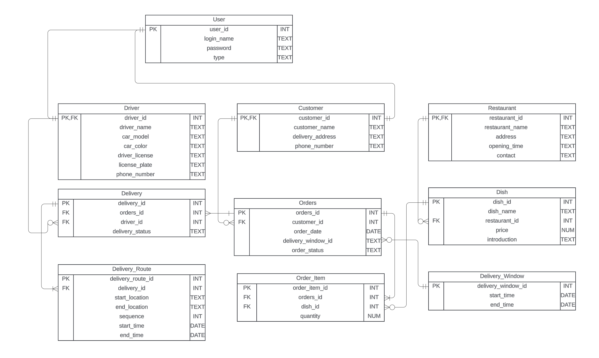
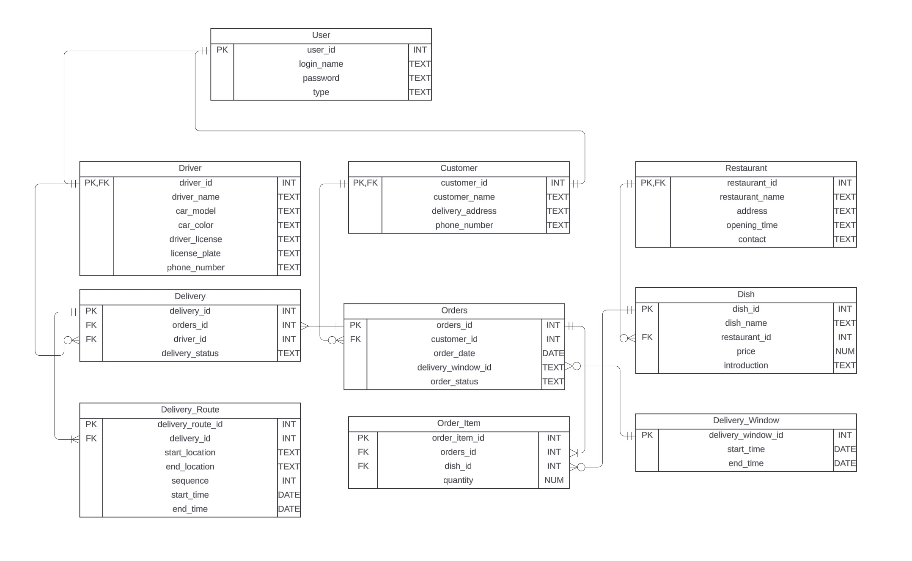
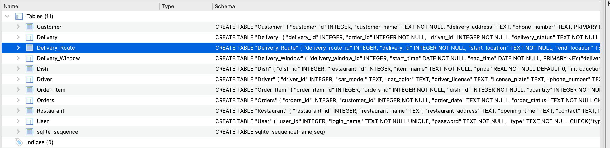

# dish-ordering-system
Project 1 Submission by Qiong Wu

## Business requirements
[Business Requirements.pdf](documents/Requirements.pdf)

## UML Class Diagram


## ERD


## Relational Schema & at least BCNF using functional dependencies.
[Relational Schema.pdf](documents/Schema.pdf)

## Database 

Test data is generated by https://www.mockaroo.com/schemas, output files are stored in db/test_data folder <br />

### Create new database and insert test data

```
cd db
touch database.db
sqlite3 database.db
.read init.sql
.read initData.sql
```

### Screen shots of tables



## Query
### a query contains a join of at least three tables

```
.read db/query1.sql
```

### a query contains a subquery

```
.read db/query2.sql
```

### a query contains a group by with a having clause

```
.read db/query3.sql
```

### a query contains a complex search criterion

```
.read db/query4.sql
```

### a query contains CASE/WHEN

```
.read db/query5.sql
```

## Application
at project root folder
```
npm install
npm start
```

visit http://localhost:3000/


